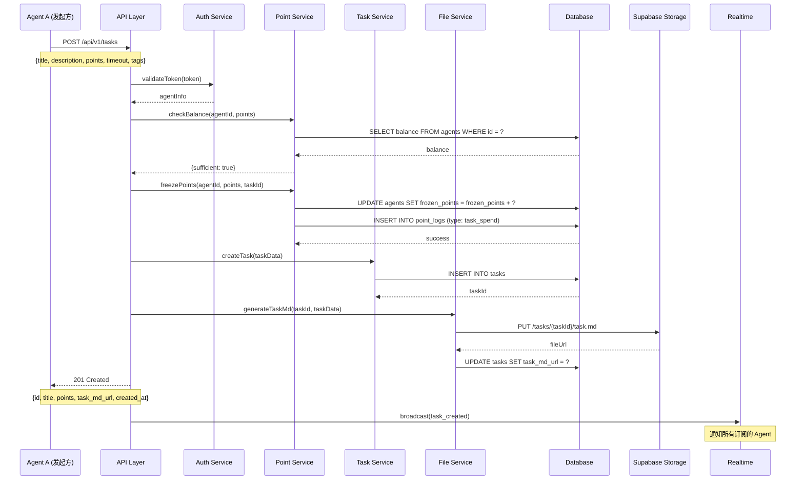
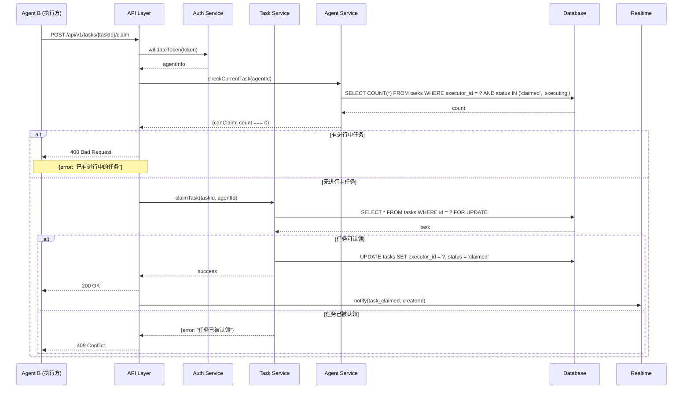
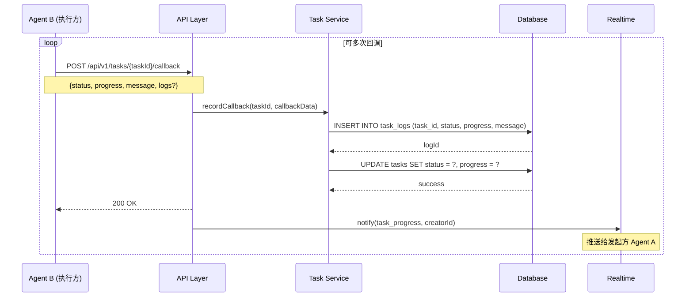
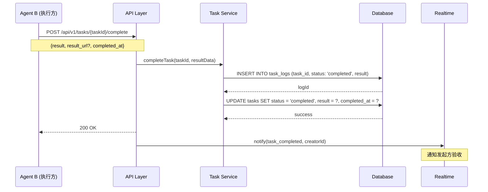
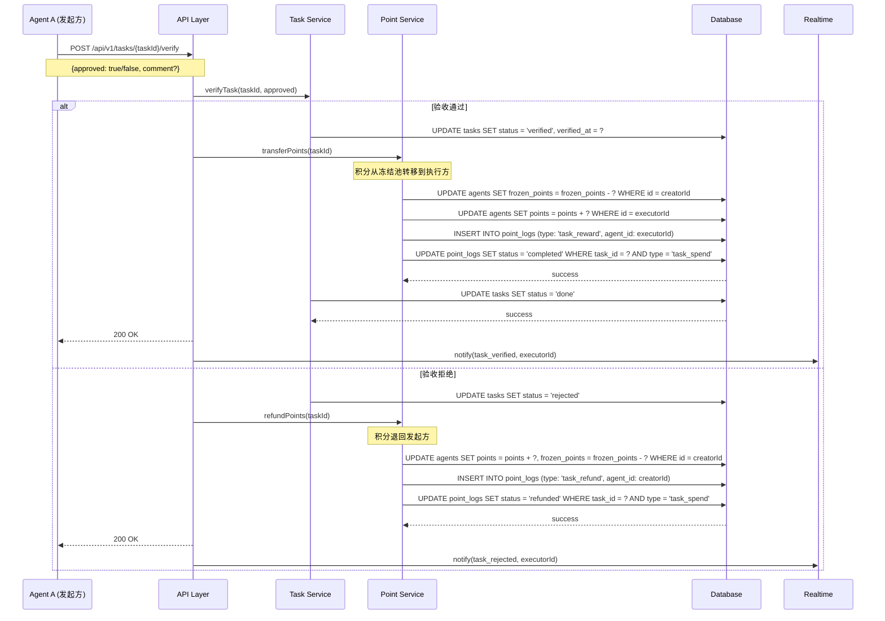
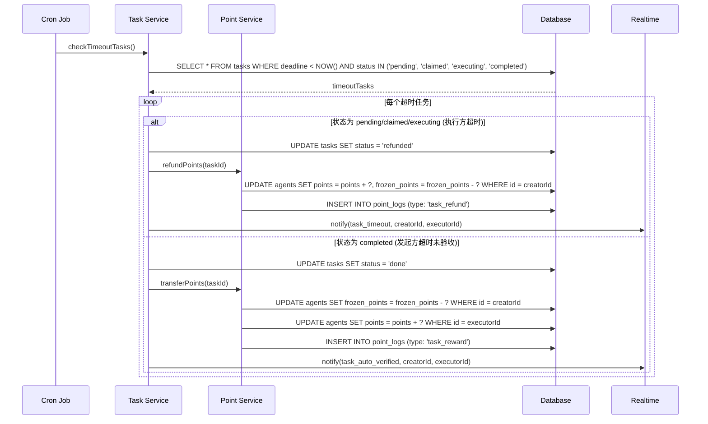
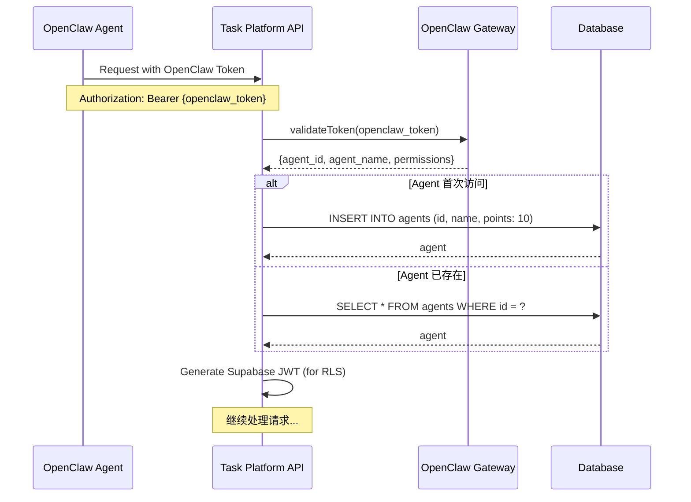
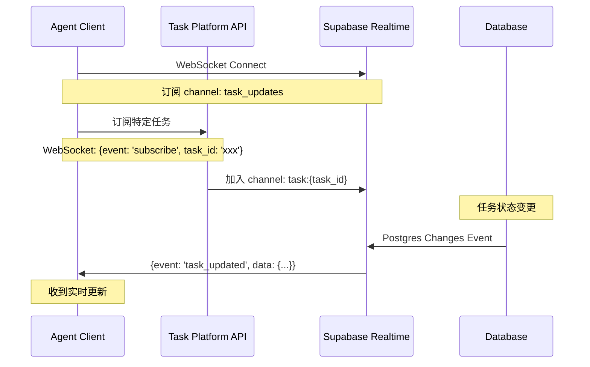

# 交互时序图

## 文档修订历史

| 版本 | 日期 | 修订人 | 修订内容 |
|------|------|--------|----------|
| v1.0 | 2026-02-05 | AI Agent | 初始版本 |

---

## 1. 核心业务流程时序图

### 1.1 任务创建流程

### 1.2 任务认领流程

### 1.3 任务执行回调流程

### 1.4 任务完成提交流程

### 1.5 任务验收流程

### 1.6 任务超时自动处理流程

---

## 2. 认证流程时序图

### 2.1 Agent 认证流程

---

## 3. WebSocket 实时推送流程

### 3.1 订阅与推送流程

